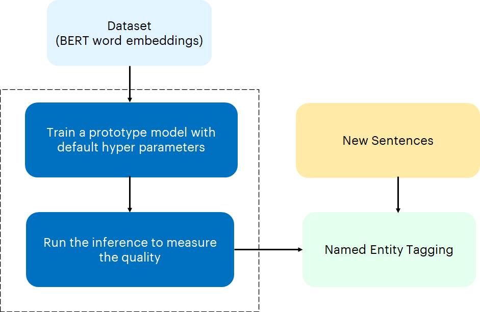
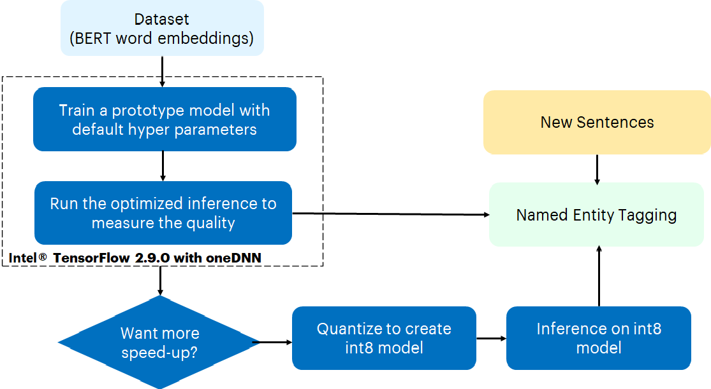

# **Tensorflow Named Entity Recognition**

# **Introduction**
Named Entity recognition‚ (NER) (also known as entity identification, entity chunking and entity extraction) is a sub-task of 
information extraction that seeks to locate and classify named entities in text into pre-defined categories such as the names 
of persons, organizations, locations, expressions of times, quantities, monetary values, percentages, etc.

For example, Healthcare Payers employ hundreds of clinicians who review millions of claim-related documentation pages searching 
for relevant data points to then draw a conclusion manually. Similarly, other applications which require to review documentation
pages searching for relevant data points to draw a conclusion includes Optimizing Search Engine Algorithms, Question-Answer Systems, 
Gene Identification, DNA Identification, Identification of Drug Names and Disease Names and Simplifying Customer Support.

As information is exponentially increasing, often in non-standard formats, making it difficult for organisations to manage; 
Manual reviews waste time and tends to inaccurate results contributing to dissatisfaction. All those challenges have forced 
organisations to look for solutions to automate these applications.

The experiment is aimed to expedite the classification of key information from a text, illustrating the selection of relevant 
data points, for example that a clinician will perform from a claim or a claim related document. The goal is therefore to locate 
and classify named entities in text into pre-defined categories using Tensorflow BERT Transfer Learning NER Model

## **Table of Contents**
 - [Purpose](#purpose)
 - [Reference Solution](#proposed-solution)
 - [Reference Implementation](#reference-implementation)
 - [Intel® Implementation](#optimizing-the-E2E-solution-with-Intel®-oneAPI)
 - [Performance Observations](#performance-observations)

## **Purpose**
As indicated above, the main objective is to locate and classify named entities using Tensorflow BERT Transfer Learning NER Model. 
This can be broken down into two sub-tasks: identifying the boundaries of the named entities, and identifying its type.

With NER, organizations look to automate to address the following challenges:
- Manual documentation reviews are time-consuming, complex, and monotonous
- The volume of reviews are substantially increasing
- Humans are prone to error, can easily be distracted, and miss critical components
- Non-standard data limits feedback for analytics and operational teams
- Growing shortage of highly skilled staff to review documents

<p>The models built for NER are predominately used as intermediate models in complex AI model architecture designed for various data 
science applications. 

## **Reference Solution**
In this reference kit, we build a deep learning model to predict the named entity tags for the given sentence. We also focus on below critical factors
- Faster model development and 
- Performance efficient model inference and deployment mechanism.

<br>Named entity recognition is a task that is well-suited to the type of classifier-based approach. In particular, a 
tagger can be built that labels each word in a sentence using the IOB format, where chunks are labelled by their appropriate type. </br>

The IOB Tagging system contains tags of the form:

```
B - {CHUNK_TYPE} for the word in the Beginning chunk 
I - {CHUNK_TYPE} for words Inside the chunk 
O - Outside any chunk 
```

The IOB tags are further classified into the following classes

```
geo = Geographical Entity 
org = Organization 
per = Person 
gpe = Geopolitical Entity 
tim = Time indicator 
art = Artifact 
eve = Event 
nat = Natural Phenomenon.
```
As documents are constantly changing, clients using these solutions must re-train their models to deal with ever-increased and 
changeable data sets. Therefore, training and inference prediction of named entity tags is done in batches with different dataset 
sizes to illustrate this scenario. Inference prediction was also done in real-time (batchsize 1) to illustrate the selection of 
relevant data points similar to a scenario wherein a clinician will get from a claim or a claim related when a document is loaded.

Since GPUs are the natural choice for deep learning and AI processing to achieve a higher FPS rate but they are also very expensive 
and memory consuming, the experiment applies model quantization using Intel's technology which compresses the models using quanitization 
techniques and use the CPU for processing while maintaining the accuracy and speeding up the inference time of named entity tagging.

### **Key Implementation Details**

The reference kit implementation is a reference solution to the Named Entity Recognition use case that includes 

  1. A reference E2E architecture to arrive at an AI solution with BERT Transfer Learning Model using Tensorflow 2.8.0
  2. An Optimized reference E2E architecture enabled with Intel® Optimizations for Tensorflow 2.9.0 

## **Reference Implementation**

### ***E2E Architecture***
### **Use Case E2E flow**



### ***Hyper-parameter Analysis***

In realistic scenarios, an analyst will run the BERT Transfer Learning Model multiple times on the same dataset, scanning across different hyper-parameters.  To capture this, we measure the total amount of time it takes to generate results across different hyper-parameters for a fixed algorithm, which we define as hyper-parameter analysis.  In practice, the results of each hyper-parameter analysis provides the analyst with many different models that they can take and further analyze.

The below table provide details about the hyperparameters & values used for hyperparameter tuning in our benchmarking experiments:
| **Algorithm**                     | **Hyperparameters**
| :---                              | :---
| BERT Transfer Learning            | Batch size - 1, 32, 64 and 128

In the benchmarking results given in later sections, inference time for batch size of 1  which can also be read as real time inference 
for one test sample.

### **Dataset**
<!-- Dataset Details -->
Dataset used in this reference kit is taken from [Kaggle](https://www.kaggle.com/datasets/abhinavwalia95/entity-annotated-corpus)
> *Please see this data set's applicable license for terms and conditions. Intel Corporation does not own the rights to this data set and does not confer any rights to it.*

Each row in the data set represents sentence and its corresponding named entity tags and contains below features for the training
- ***SentenceID*** - Sentence Identification number
- ***Word*** - The words of the sentence
- ***POS*** - Parts of speech of each word
- ***Tag*** - Named entity tags for each word

Based on these features "SentenceID", "Word", "POS", the model is trained to predict named entity tag ("Tag").

Follow the below mentioned steps to download the dataset
The NER dataset is downloaded from kaggle and extracted in a data folder before running the training python module.

1) Create a data folder using command
```sh
mkdir data
```
2) Create a kaggle folder using 
```sh
mkdir kaggle
```
3) Navigate inside the kaggle folder using the command 
```sh
cd kaggle
```
4) Install kaggle if not done using the below command:
```sh
pip install kaggle
```
6) Go to https://www.kaggle.com/ . Login to your Kaggle account. Go to 'Account Tab' & select 'Create a new API token'. 
This will trigger the download of kaggle.json file. This file contains your API credentials.
7) Move the downloaded 'kaggle.json' file to folder 'kaggle'
8) Execute the following command
```sh
chmod 600 kaggle.json
```
10) Export the kaggle username & token to the enviroment
```sh
export KAGGLE_USERNAME="user name"
export KAGGLE_KEY="key value"
```
14) The "user name" and "key" can be found in the kaggle.json file.
15) Run the following command to download the dataset
```sh
kaggle datasets download -d abhinavwalia95/entity-annotated-corpus
```
16) The file "entity-annotated-corpus.zip" will be downloaded in the current directory
17) Move the entity-annotated-corpus.zip file into data folder by executing this command.
```sh
mv entity-annotated-corpus.zip ./data/
```
18) Unzip the downloaded dataset by executing below
```sh
cd ./data/
sudo apt install unzip
unzip entity-annotated-corpus.zip
```
19) This will create two files ner_dataset.csv and ner_csv. The ner_dataset.csv will be used to 
generate the training and testing datasets.
20) Run the script gen_dataset.py in the root directory to generate the training and testing datasets.
```sh
cd ../

python src/gen_dataset.py --dataset_file ./data/ner_dataset.csv
```
21) The files ner_dataset.csv, ner_test_dataset.csv and ner_test_quan_dataset.csv files will be generated in the current 
directory.
22) Move these files into "data" folder.
```sh
mv ner_dataset.csv ./data/
mv ner_test_dataset.csv ./data/
mv ner_test_quan_dataset.csv ./data/
```

>Note:
The dataset consisted of 48K sentences with corresponding parts of speech and labeled tags.
For data preparation, it has split into train and evaluation sets. For training, the dataset has been reduced 
to 24K sentences by removing 50% of records from the original dataset file. For inference, dataset has been 
reduced to 2500 records.

### **Input**
The input dataset consists of sentences for which named entity tagging need to be performed. Each of the sentences are identified by below features.
1. Unique ID
2. Words of sentence
3. Parts of speech for each word

<b>Example:</b>
```
They marched from the Houses of Parliament to a rally in Hyde Park
```

|**Unique ID**    |**Word**       |**Parts of speech**
| :---        | :---      | :---
|1            |They		    | PRP
|             |marched	  |VBD
|             |from		    |IN
|             |the		    |DT
|             |Houses	    |NNS
|             |of		      |IN
|             |Parliament	|NN
|             |to		      |TO
|             |a		      |DT
|             |rally		  |NN
|             |in		      |IN
|             |Hyde		    |NNP
|             |Park		    |NNP
|             |.		      |.

### **Expected Output**
For the given input sentence and its features, the expected output is the named entity tagging for each of the words in the sentence. 

<b>Example:</b>
```
They marched from the Houses of Parliament to a rally in Hyde Park
```
|**Word**       |**Named Entity Tag**
| :---          | :---
|They		        |O
|marched	      |O
|from		        |O
|the		        |O
|Houses	        |O
|of		          |O
|Parliament	    |O
|to		          |O
|a		          |O
|rally		      |O
|in		          |O
|Hyde		        |B-geo
|Park		        |I-geo
|.		          |O

### ***Software Requirements***

1. Python - 3.9.x
2. Tensorflow - 2.8.0

First clone the respository executing the below command.
```
git clone https://github.com/oneapi-src/document-automation.git
```
Note that this reference kit implementation already provides the necessary scripts to setup the software requirements. 
To utilize these environment scripts, first install Anaconda/Miniconda by following the instructions at the following link

[Anaconda installation](https://docs.anaconda.com/anaconda/install/linux/)
or
https://docs.conda.io/projects/conda/en/latest/user-guide/install/index.html

### ***Solution setup***
Follow the below conda installation commands to setup the Stock enviroment along with the necessary packages for this model training and prediction.
>Note: It is assumed that the present working directory is the root directory of this code repository

```
conda env create --file env/stock/ner_stock.yml
```

>Note:
If while creating the environment if the error "command 'gcc' failed: No such file or directory" occurs then,
install gcc using the command below.
sudo apt-get install gcc

This command utilizes the dependencies found in the `env/stock/ner_stock.yml` file to create an environment as follows:

**YAML file**                       | **Environment Name**         |  **Configuration** |
| :---: | :---: | :---: |
| `env/stock/ner_stock.yml`             | `ner_stock` | Python=3.9.x with Tensorflow 2.8.0

Use the following command to activate the environment that was created:
```sh
conda activate ner_stock
```

After activating the environment for stock Tensorflow framework, make sure the oneDNN flag is 
disabled by running the below instruction at the command line.
```
export TF_ENABLE_ONEDNN_OPTS=0
```

Verify if the flag is enabled by using the below command.
<br>
```
echo $TF_ENABLE_ONEDNN_OPTS
```

### **Reference Sources**
*Case Study* https://www.kaggle.com/code/ravikumarmn/ner-using-bert-tensorflow-99-35/notebook<br>

### ***Solution implementation***

#### **Model building process**
The Python script given below need to be executed to start training using the 
active environment enabled by using the above steps to setup the environment. 

The script will run the benchmarks for the passed parameters and displays the corresponding 
training time in seconds. The details of the script and parameters are given below.

Execute the Python script as given below to start training for specific batch size and given dataset file.
```shell
python src/run_modeltraining.py --batchsize <batchsize value> --dataset_file <dataset filename> -i <intel/stock> --save_model_path <save file path>

```

  Arguments:<br>
```
  --help                   show this help message and exit
  --batchsize              Give the required batch sizes
  --dataset_file           Give the name of dataset file
  --i                      0 for stock, 1 for intel environment
  --save_model_path        Give the directory path to save the model after the training
```
<b>Note:</b> 
1) The dataset file and save_model_path parameters are mandatory to be given, remaining parameters if not given will take the default values
2) --help option will give the details of the arguments

<b>Example</b>: 
```shell
python src/run_modeltraining.py --batch_size 128 --dataset_file "./data/ner_dataset.csv" --intel 0 --save_model_path "./models/trainedmodels/"
```
This command runs the model with batch size of 128, using dataset file <i>ner_dataset.csv</i>, for stock environment
and saves the trained model in <i>"./models/trainedmodels/stock/model_b128/" </i> folder and 
subsequently, outputs the training time of the model. The user can collect the logs by 
redirecting the output to a file as illustrated below.

```shell
python src/run_modeltraining.py --batch_size 128 --dataset_file "./data/ner_dataset.csv" --intel 0 --save_model_path "./models/trainedmodels/" | tee <log_file_name>
```


The output of the python script <i>run_modeltraining.py</i> will be collected in the file <log_file_name>

**Expected Output**

Output would be generated by the Python script <i>run_modeltraining.py</i> which will capture the overall training time in seconds.
The output can be redirected to a file as per the command above.

The lines below are from the sample output of the python script <i>run_modeltraining.py</i> and it gives details of training the model

    ----------------------------------------
    # Model Training 
    # Time (in seconds): 6879.922860383987
    # Batch size: 32
    # Model saved path: ./models/trainedmodels/
    ----------------------------------------

### Model Inference or Predictions
The Python script given below need to be executed to do inference using the 
active environment enabled by using the above steps to setup the environment. 

The script will run the benchmarks for the passed parameters and 
displays the corresponding inference time in seconds. The details of the script
and parameters are given below.

Execute the Python script as given below to perform prediction for specific batch size and dataset file.
```shell
python src/run_inference.py --batchsize <batchsize value> --dataset_file <dataset filename> -i <intel/stock> --model_path <model file path>

```

  Arguments:<br>
```
  --help                   show this help message and exit
  --batchsize              Give the required batch sizes
  --dataset_file           Give the name of test dataset file
  --i                      0 for stock, 1 for intel environment
  --model_path             Give the directory path the trained model
```

<b>Note:</b>
1) All the options above are optional expect for test dataset file and model_path, if not given will take the default values
2) --help option will give the details of the arguments<br>

<b>Example</b>: 
```shell
python src/run_inference.py --batch_size 128 --dataset_file "./data/ner_test_dataset.csv" --intel 0 --model_path "./models/trainedmodels/stock/model_b128/model_checkpoint"
```
This command runs the model with batch size of 128, using test dataset file <i>ner_test_dataset.csv</i>, for stock environment
for the trained model (trained in intel environment) in <i>"./models/trainedmodels/stock/model_b128/model_checkpoint"</i> folder and 
subsequently, outputs the inference time of the model. The user can collect the logs by 
redirecting the output to a file as illustrated below.

```shell
python src/run_inference.py --batch_size 128 --dataset_file "./data/ner_test_dataset.csv" --intel 0 --model_path "./models/trainedmodels/stock/model_b128/model_checkpoint" | tee <log_file_name>
```
The output of the script <i>run_inference.py</i> will be collected in the log_file_name.

**Expected Output**

Output would be generated by the Python script <i>run_inference.py</i> which will capture the overall inference time in seconds.
The output can be redirected to a file as per the command above.

The lines below from the sample output of the python script run_inference.py and it gives details of inference of the model

    ----------------------------------------
    # Model Inference details:
    # Real time inference (in seconds): 0.11928558349609375
    # Average batch inference:
    #   Time (in seconds): 5.85315097249349
    #   Batch size: 128
    ----------------------------------------


## **Optimizing the E2E solution with Intel Optimizations for Tensorflow**
Although AI delivers a solution to address named entity recognition, on a production scale implementation with millions 
or billions of records demands for more compute power without leaving any performance on the table. Under this scenario, 
a named entity recognition models are essential for identifying and extracting entities which will enable analyst to take
appropriate decisions. For example in healthcare it can be used to identifying and extracting entities like diseases, tests,
treatments and test results.  In order to derive the most insightful and beneficial actions to take, they will need to study 
and analyze the data generated though various feature sets and algorithms, thus requiring frequent re-runs of the algorithms 
under many different parameter sets. To utilize all the hardware resources efficiently, Software optimizations cannot be ignored.   
 
This reference kit solution extends to demonstrate the advantages of using the Intel AI Analytics Toolkit on the task of building a model for classifiying named entity taggings.  The savings gained from using the Intel optimizations for Tensorflow can lead an analyst to more efficiently explore and understand data, leading to better and more precise targeted solutions.

#### Use Case E2E flow


### **Optimized software components**
Intel Optimized Tensorflow (version 2.9.0 with oneDNN) TensorFlow framework has been optimized using oneAPI Deep Neural Network Library (oneDNN) primitives, a popular performance library for deep learning applications. It provides accelerated implementations of numerous popular DL algorithms that optimize performance on Intel® hardware with only requiring a few simple lines of modifications to existing code.

Intel® OneAPI Neural Compressor (version 1.10.1) INC is an open-source Python* library. ML developers can incorporate this library for quantizing the deep learning models. It supports two types of quantization as mentioned below​

Quantization Aware Training​
1) Accuracy Aware Quantization​
2) Default Quantization​

Post Training Quantization​
1) Accuracy Aware Quantization​
2) Default Quantization

### ***Software Requirements***
| **Package**                | **Intel® Python**
| :---                       | :---
| Python                     | 3.9.x
| Tensorflow                 | 2.9.0
| Neural Compressor          | 1.12

### ***Optimized Solution setup***
Follow the below conda installation commands to setup the Stock enviroment along with the necessary packages for this model training and prediction.
>Note: It is assumed that the present working directory is the root directory of this code repository

```shell
conda env create --file env/intel/ner_intel.yml
```
>Note:
If while creating the environment if the error "command 'gcc' failed: No such file or directory" occurs then,
install gcc using the command below.
sudo apt-get install gcc

This command utilizes the dependencies found in the `env/intel/ner_intel.yml` file to create an environment as follows:

**YAML file**                                 | **Environment Name** |  **Configuration** |
| :---: | :---: | :---: |
| `env/intel/ner_intel.yml`             | `ner_intel` | Python=3.9.x with Intel Optimized Tensorflow 2.9.0

For the workload implementation to arrive at first level solution we will be using the intel environment

Use the following command to activate the environment that was created:
```shell
conda activate ner_intel
```

### ***Optimized Solution implementation***
After activating the environment for Intel Tensorflow framework, make sure the oneDNN flag is 
enabled by running the below instruction at the command line.
```shell
export TF_ENABLE_ONEDNN_OPTS=1
```

Verify if the flag is enabled by using the below command.
<br>
```shell
echo $TF_ENABLE_ONEDNN_OPTS
```

#### **Model building process with Intel® optimizations**
The python script run_modeltraining.py used for training on stock version is used for training the model on Intel environment also
as per example below.

<b>Example</b>: 
```shell
python src/run_modeltraining.py --batch_size 128 --dataset_file "./data/ner_dataset.csv" --intel 1 --save_model_path "./models/trainedmodels/"
```
This command runs the model with batch size of 128, using dataset file <i>ner_dataset.csv</i>, for intel environment
and saves the trained model in <i>"./models/trainedmodels/stock/model_b128/" </i> folder and 
subsequently, outputs the training time of the model. The user can collect the logs by 
redirecting the output to a file as illustrated below.

```shell
python src/run_modeltraining.py --batch_size 128 --dataset_file "./data/ner_dataset.csv" --intel 1 --save_model_path "./models/trainedmodels/" | tee <log_file_name>
```

The output of the python script <i>run_modeltraining.py</i> will be collected in the file <log_file_name>

**Expected Output**
Output would be generated by the Python script <i>run_modeltraining.py</i> which will capture the overall training time in seconds.
The output can be redirected to a file as per the command above.

The lines below are from the sample output of the python script <i>run_modeltraining.py</i> and it gives details of training the model

    ----------------------------------------
    # Model Training 
    # Time (in seconds): 6879.922860383987
    # Batch size: 32
    # Model saved path: ./models/trainedmodels/
    ----------------------------------------

#### **Model Inference process with Intel® optimizations**
The python script run_inference.py used to obtain inference benchmarks for stock version is used for getting inference benchmarks for 
Intel environment also as per example below.

<b>Example</b>: 
```shell
python src/run_inference.py --batch_size 128 --dataset_file "./data/ner_test_dataset.csv" --intel 1 --model_path "./models/trainedmodels/intel/model_b128/model_checkpoint"
```
This command runs the model with batch size of 128, using test dataset file <i>ner_test_dataset.csv</i>, for Intel environment
for the trained model (trained in intel environment) in <i>"./models/trainedmodels/intel/model_b128/model_checkpoint"</i> folder and 
subsequently, outputs the inference time of the model. The user can collect the logs by 
redirecting the output to a file as illustrated below.

```shell
python src/run_inference.py --batch_size 128 --dataset_file "./data/ner_test_dataset.csv" --intel 1 --model_path "./models/trainedmodels/intel/model_b128/model_checkpoint" | tee <log_file_name>
```
The output of the script <i>run_inference.py</i> will be collected in the log_file_name.

**Expected Output**
Output would be generated by the Python script <i>run_inference.py</i> which will capture the overall inference time in seconds.
The output can be redirected to a file as per the command above.

The lines below from the sample output of the python script run_inference.py and it gives details of inference of the model

    ----------------------------------------
    # Model Inference details:
    # Real time inference (in seconds): 0.11928558349609375
    # Average batch inference:
    #   Time (in seconds): 5.85315097249349
    #   Batch size: 128
    ----------------------------------------

#### **Model Conversion process with Intel Neural Compressor**
Intel® Neural Compressor is used to quantize the FP32 Model to the INT8 Model. 
Optimzied model is used here for evaluating and timing Analysis. 
Intel® Neural Compressor supports many optimization methods. 
In this case, we have used post training quantization with default quantization method to quantize the FP32 model.

Before performing the quantization of the trained model, the model is converted to frozen graph format using the <i>run_create_frozen_graph.py</i>
python script. The usage of this script to generate the frozen graph is given below.

```
python src/run_create_frozen_graph.py --model_path <trained model file path> --save_model_path <path to save the model frozen graph>
```
where,<br>
<b>model_path</b> - The path of the FP32 trained model <br>
<b>save_model_path</b> - The path to save the frozen graph format of the model given in model_path<br>

<b>Example:</b>
```
python src/run_create_frozen_graph.py --model_path "./models/trainedmodels/intel/model_b32/model_checkpoint" --save_model_path "./models/frozen_models/intel/model_b32/"
```
The model at <i>"./models/trainedmodels/intel/model_b32/model_checkpoint"</i> will be converted to frozen graph format and 
will be saved at <i>"./models/frozen_models/intel/model_b32/"</i>

Once the frozen model format of the model is created, the <i>run_neural_compressor_conversion.py</i> python script is used for 
quanitization of the FP32 trained model. The syntax for using the script
given below.

```
python src/run_neural_compressor_conversion.py --dataset_file <test dataset file name> --model_path <path of the frozen graph> --config_file <configuration file> --save_model_path <path to save the model>
```
where,
```
--dataset_file        The path of the test dataset file
--model_path          The path of the model file in the frozen graph format
--config_file         The path of the configuration file which contains the settings for the quanitization
--save_model_path     The path to save the quantized model
```
<b>Example:</b>
```
python src/INC/run_neural_compressor_conversion.py --dataset_file "./data/ner_test_quan_dataset.csv" --model_path "./models/frozen_models/intel/model_b32/frozen_graph.pb" --config_file "./env/deploy.yaml" --save_model_path "./models/quantized_models/intel/model_b32_d100/inc_model_b32_d100/"
```

where <i>"./data/ner_test_quan_dataset.csv"</i> is the name of the file which contains the samples to be used during evaluation, <i>"./models/frozen_models/intel/model_b32/frozen_graph.pb"</i> is the model file in frozen graph format, <i>"./env/deploy.yaml"</i> is the configuration
file with settings for the INC quantization module and <i>"./models/quantized_models/intel/model_b32_d100/inc_model_b32_d100/"</i>
is the path to save the quantized model.

>Note:
If while running the above script if the error "Unable to run due to ImportError: libGL.so.1: 
cannot open shared object file: No such file or directory" occurs then install libgl using the command,
sudo apt-get install libgl1

If the quanitized model need to be tuned to evaluate a specific accuracy relative to the FP32 trained model then the respective configuration
parameters need to set in the config file. The python script <i>run_neural_compressor_tune_conversion.py</i> need to used for the same. The syntax
of the script and usage is given below.

```
python src/INC/run_neural_compressor_tune_conversion.py --dataset_file <test dataset file name> --model_path <path of the frozen graph> --config_file <configuration file> --save_model_path <path to save the model>
```
where,
```
--dataset_file        The path of the test dataset file
--model_path          The path of the model file in the frozen graph format
--config_file         The path of the configuration file which contains the settings for the quanitization
--save_model_path     The path to save the quantized model
```
The usage of the script is similar to the <i>run_neural_compressor_conversion.py</i> except for the configuration file.

<b>Example:</b>
```
python src/INC/run_neural_compressor_tune_conversion.py --dataset_file "./data/ner_test_quan_dataset.csv" --model_path "./models/frozen_models/intel/model_b32/frozen_graph.pb" --config_file "./env/deploy_accuracy.yaml" --save_model_path "./models/acc_quantized_models/intel/model_b32_d100/inc_model_b32_d100/"
```

where <i>"./data/ner_test_quan_dataset.csv"</i> is the name of the file which contains the samples to be used during evaluation, <i>"./models/frozen_models/intel/model_b32/frozen_graph.pb"</i> is the model file in frozen graph format, <i>"./env/deploy_accuracy.yaml"</i> is the configuration
file with settings for the INC quantization module to fine tune the quanitized model and <i>"./models/acc_quantized_models/intel/model_b32_d100/inc_model_b32_d100/"</i>
is the path to save the quantized model.

>Note:
If while running the above script if the error "Unable to run due to ImportError: libGL.so.1: 
cannot open shared object file: No such file or directory" occurs then install libgl using the command,
sudo apt-get install libgl1

#### **Model Inference process with Intel® Quanitizations**
Now that the quantized model is created using INC it can be used for inferencing on the test data and perform benchmarking.
The inferencing is done on the FP32 model and INC quantized model and results for real time inference and batch inference are used
for benchmarking.

The python script <i>run_neural_compressor_inference.py</i> is used for perform predictions on the test data. The syntax to use the script 
is given below.

```
python src/INC/run_neural_compressor_inference.py --batch_size 32 --dataset_file <test dataset file> --model_path <FP32 or INC frozen graph file>
```
where,
```
--batch_size      Give the required batch size for inference
--dataset_file    The path of the test data set file name
--model_path      The path of the FP32 or quantized frozen graph model
```
<b>Example:</b>
```
python src/INC/run_neural_compressor_inference.py --batch_size 128 --dataset_file "./data/ner_test_quan_dataset.csv" --model_path "./models/quantized_models/intel/model_b128_d100/inc_model_b128_d100.pb" | tee <log_file_name>
```

The inference is done for batch size of 128, with test dataset file <i>"./data/ner_test_quan_dataset.csv"</i>, using the 
model <i>"./models/frozen_models/frozen_graph.pb"</i> in frozen graph format. The model can also be a 
quantized model in frozen graph format.

## **Performance Observations**
This section covers the inference time comparison between Stock Tensorflow version and Intel Tensorflow distribution for this model training and prediction. The results are captured for varying batch sizes which includes training time and inference time. The results are used to calculate the performance gain achieved by using Intel One API packages over stock version of similar packages.


<br>**Key Takeaways**<br>
- TensorFlow 2.9.0 with Intel OneDNN offers real time inference speed-up of upto 1.08x and batch inference time speed-up ranging between 1.16x and 1.24x compared to stock TensorFlow 2.8.0 version with different batch sizes.
- Intel® Neural Compressor distribution with default quantization offers real time inference speed-up of upto 1.94x and batch inference time speed-up ranging between 1.86x and 1.93x compared to Stock TensorFlow 2.8.0 version with different batch sizes.

#### **Conclusion**
To build a named entity recognition solution using BERT transfer learning approach, at scale, Data Scientist will need to train models for substantial datasets and run inference more frequently. The ability to accelerate training will allow them to train more frequently and achieve better accuracy. Besides training, faster speed in inference will allow them to run prediction in real-time scenarios as well as more frequently. A Data Scientist will also look at data classification to tag and categorize data so that it can be better understood and analyzed. This task requires a lot of training and retraining, making the job tedious. The ability to get it faster speed will accelerate the ML pipeline. This reference kit implementation provides performance-optimized guide around named entity tag prediction use cases that can be easily scaled across similar use cases.

## Appendix

### **Experiment setup**

| Platform                          | Microsoft Azure: Standard_D8_v5 (Ice Lake)<br>Ubuntu 20.04
| :---                              | :---
| Hardware                          | Azure Standard_D8_V5
| CPU cores                         | 8
| Memory                            | 32GB
| Software                          | Intel® oneAPI AI Analytics Toolkit, Tensorflow
| What you will learn               | Advantage of using Intel OneAPI TensorFlow (2.9.0 with oneDNN enabled) over the stock Tensorflow (Tensorflow 2.8.0) for the BERT transfer learning model architecture training and inference. Advantage of Intel® Neural Compressor over Intel OneAPI TensorFlow (2.9.0 with oneDNN enabled).

